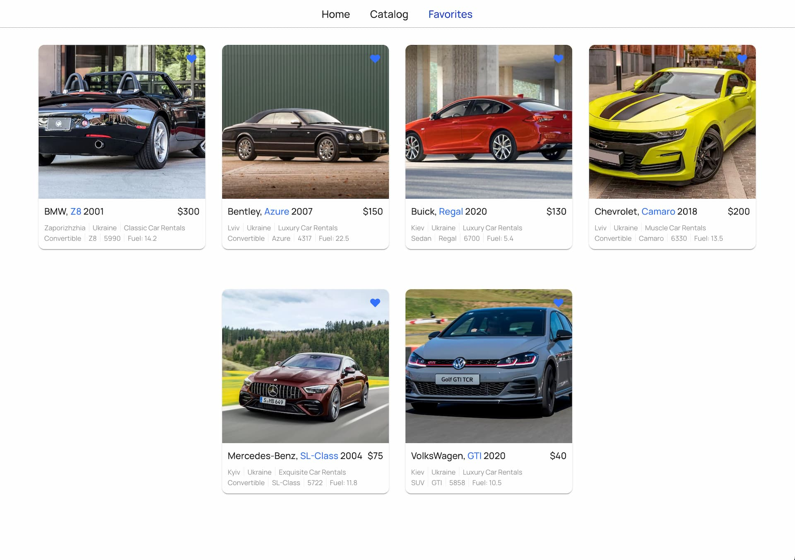

# Car Rental

[Car Rental](https://k-basket.github.io/car-rental/) - застосунок для компаній,
що надають послуги оренди автомобілів.

## Огляд застосунку

### Застосунок складається с трьох сторінок

1. Домашня сторінка - <kbd>Home</kbd>

   

2. Сторінка каталогу оренди автомобілів - <kbd>Catalog</kbd>, де можна за
   допомогою різноманітних фільтрів обрати автомобіль, відкрити модальне вікно з
   подробицями про обране авто, та з'єднатись з компанією.

   

3. Сторінка доданих авто в улюблені - <kbd>Favorites</kbd>, список обраних авто,
   де можна переглянути обрані авто, відкрити модальне вікно з подробицями, а
   також видалити з улюблених.

   

### Застосунок адаптовано під різні девайси:

- Mobile
- Tablet
- Desktop

## Технічні можливості застосунку

- Фільтрація списку авто за брендом, ціною та пробігом.
- Фільтрація списку окремо за кожним фільтром.
- Перегляд повної інформації про авто в модальному вікні, та з'еднання з
  компанією для замовлення.
- Додавання (видалення) авто до улублених здійснюється на сторінках
  <kbd>Catalog</kbd>, <kbd>Favorites</kbd> та в модальному вікні.
- При натисканні на кнопку <kbd>Search</kbd> здійснюється фільтрація за обраними
  параметрами, кнопка змінюється на <kbd>Clean</kbd>, та при натисканні очистить
  всі параметри фільтрів до дефолтних. Одже, якщо обрати новий параметр
  фільрації, кнопка змінюється на <kbd>Search</kbd>, та при натисканні здійснить
  пошук за обраним(и) параметром(ми).

## Технології, використані в застосунку

- React
- React Router
- RTK Query
- Styled Components
- Mockapi.io
